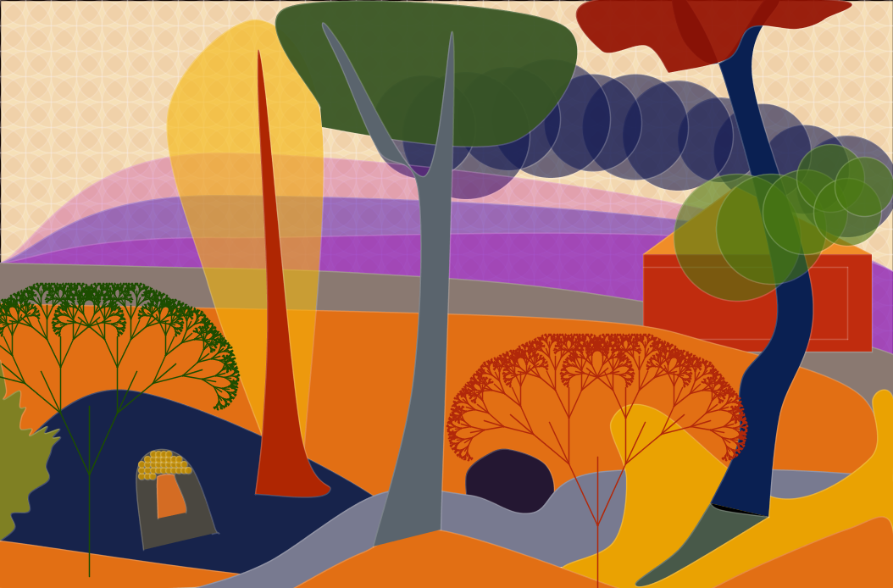
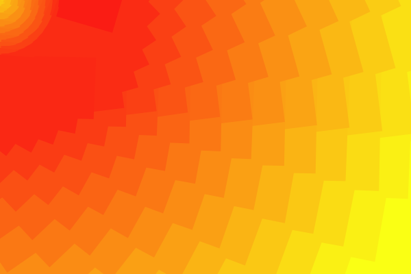
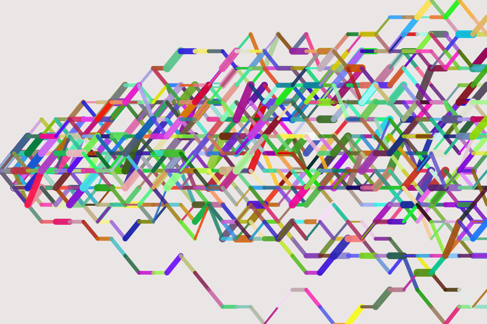
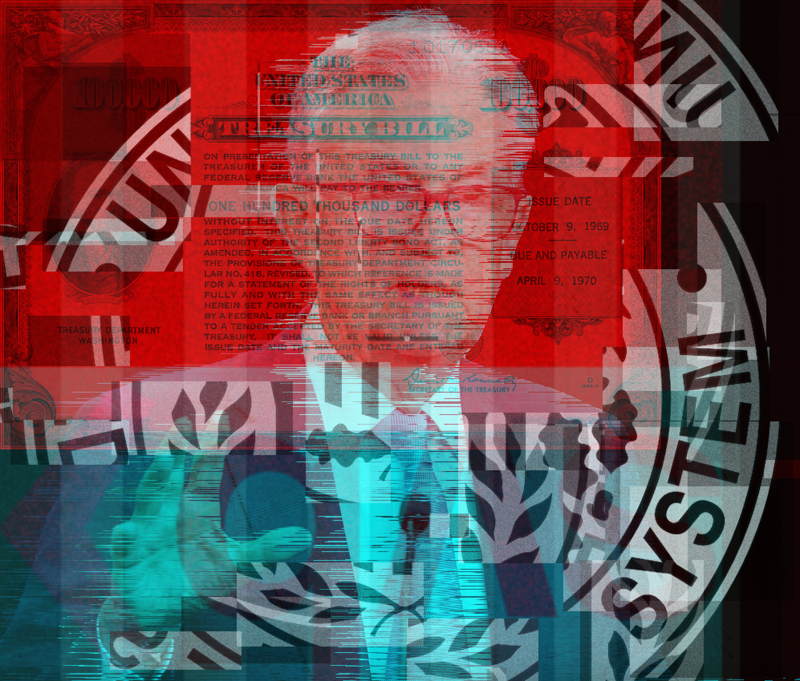
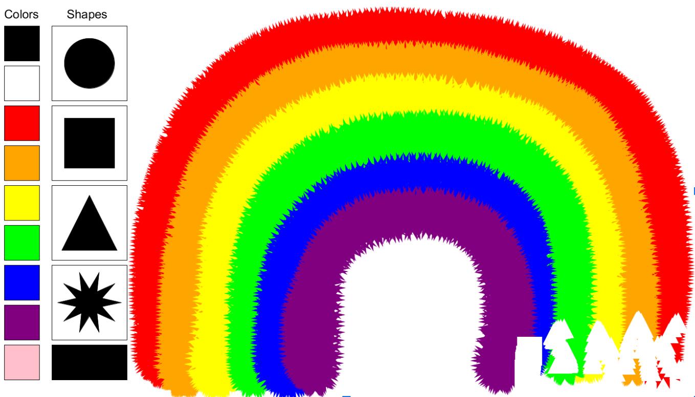

# Sketches

1. [Coordinates](coordinates): Reinterpretation of a famous landscape painting
- The Chaotic Forest (my reinterpretation of The Turning Road by Andre Derain)

2. [Repetition](repetition): Creating a virtual textile
- Geometric Sunlight

3. [Indeterminacy](indeterminacy): Using randomness to produce art
- Bullish or Bearish?

4. [Nonlinearity](nonlinearity): A nonlinear narrative in text adventure style
- Don't Kill the Celiac

5. [Glitch](glitch): Creating a "glitch" effect on a collection of images 
- A Glitch in the Banking System

6. [Time](time): A sketch with time as its central theme
- Hypnotic Weave

8. [Emergence](emergence): A simulation that demostrates emergent behavior (complexity arises from simple interactions)
- Chaotic Crossing

9. [Interface](interface): A software painting interface for a specific use case
- BlindBrush: A painting program for the blind

